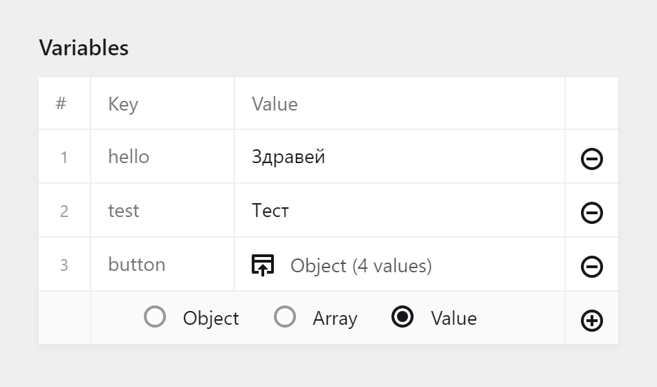

# kirby-variables-field

Field for Kirby 3 that allows you to manage langauge variables via the panel. To do that, it uses [kirby-easyvars](https://github.com/OblikStudio/kirby-easyvars) to put those variables in YAML files so they're easy to work with.



## Installation

```
composer require oblik/kirby-variables-field
```
...or check out the [other plugin installation methods](https://getkirby.com/docs/guide/plugins/plugin-setup-basic#the-three-plugin-installation-methods).

## Usage

**Important:** Make sure to configure your variables correctly by putting them in YAML files. Read [here](https://github.com/OblikStudio/kirby-easyvars#usage) to learn how.

In a blueprint, simply add a new field and set its type to `variables`:

```yml
fields:
  vars:
    type: variables
    label: Variables
```

This will create an editor for all variables where you can add new ones, or remove and sort them.

**Note:** This is a "fake" field and no actual value will be saved in the site/page txt file. All values are saved in the YAML files provided by easyvars where the variables reside. This means that it doesn't matter what field name you choose for the variables field.

## Options

Before looking at the options, it's recommended to read through the [kirby-easyvars documentation](https://github.com/OblikStudio/kirby-easyvars) to know how it changes the workflow with variables.

### `variable`

You can specify exactly which variable you want to be editable. For example, if you have this in _bg.yml_:

```yml
test: Тест
greetings:
  hello: Здравей
```

...and this in your blueprint:

```yml
myfield:
  type: variables
  variable: greetings.hello
  label: Hello
```

...you'll get the following result:


In the case above, if you want editors to be able to add new entries in the `greetings` group, you can simply change:

```yml
variable: greetings.hello
```

...to:

```yml
variable: greetings
```

This will show the variable editor instead.

### `editor`

When you've specified a group of variables to edit and the editor is shown, you can configure it:

```yml
myfield:
  type: variables
  editor:
    sort: false
    mutate: false
```

All `editor` options are:

- `keys` whether object keys are editable. Default: `false`.
- `values` whether values are editable. Default: `true`.
- `sort` whether you can sort the variables. Default: `true`.
- `mutate` whether you can add/remove entries. Default: `true`.

## KirbyTag

This field also comes with a KirbyTag, called `var`. It simply outputs a variable with a fallback default value. For example:

_en.yml_:
```yml
labels:
  test: Test
```

In your content:
```
This is the label (var: labels.test default: Default Value)
```

Result:
```
This is the label Test
```

This is useful because editors can create variables and use them in the content, instead of repeating themselves.
